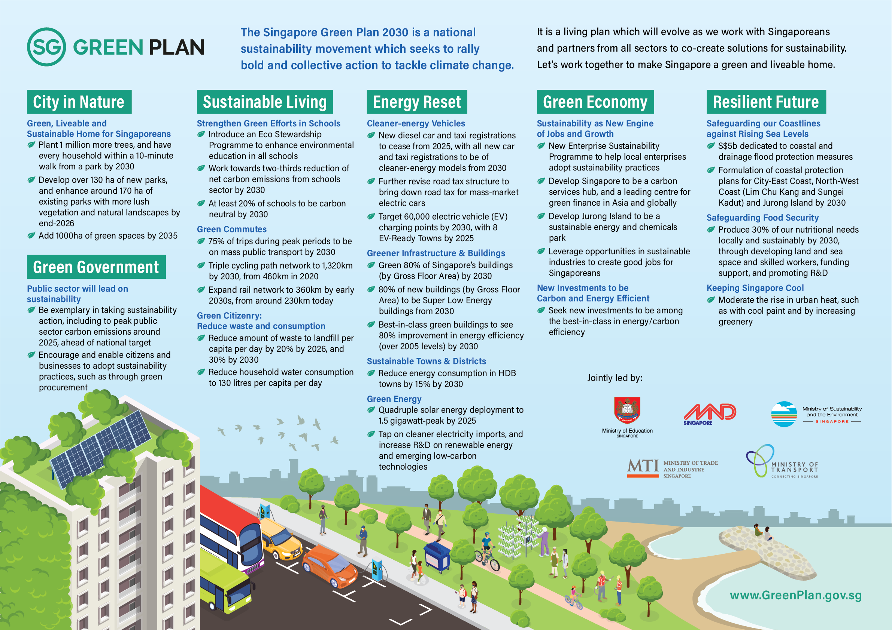

**[Download Infographic](../resources/sgp-cos-infographics.pdf){:class="external-link" target="_blank"}** 

**[Factsheet](../resources/cos-sgp-factsheet.pdf){:class="external-link" target="_blank"}**  

**Speeches**

[PMO] Speech by SM Teo Chee Hean: A Considered, Committed and Collective Approach to the Global Climate Crisis
[MSE] Speech by Min Grace Fu: The Singapore Green Plan - A Pledge to Our Children and Future Generations
[MND] Speech by Min Desmond Lee: A City in Nature, a Greener Urban Environment
[MOE] Speech by Min Lawrence Wong -
[MOT] Speech by Min Ong Ye Kung: A New Drive
[MTI] Min Chan Chun Sing: Becoming a bright green spark - An economy of stewardship
[MTI] Min Tan See Leng: Energy Reset
