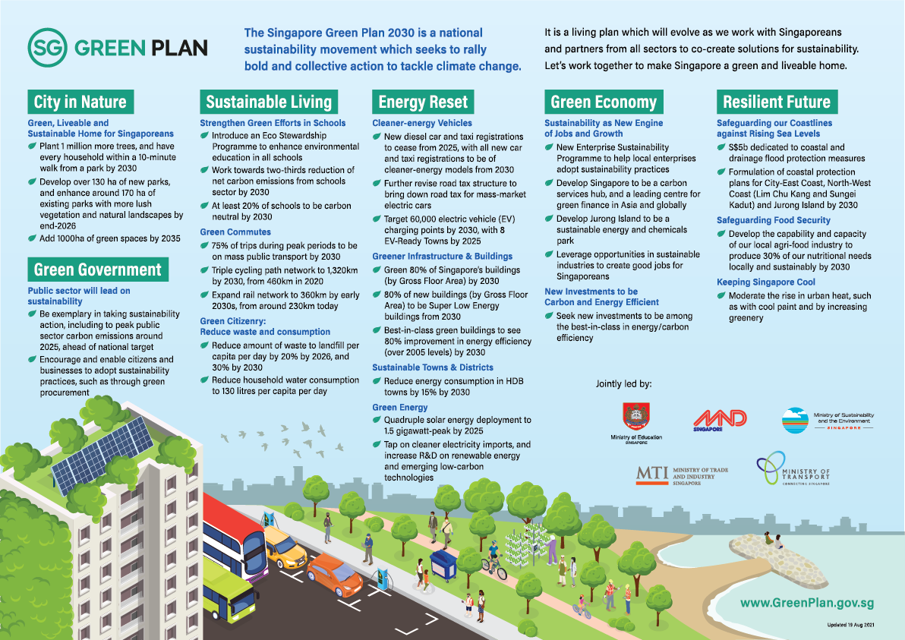

 *[Download Infographic](../files/resources/cos-sgp-infographics.pdf)*

### **Speeches**

- [PMO - Senior Minister Teo Chee Hean: A Considered, Committed and Collective Approach to the Global Climate Crisis](/resource-room/2021-03-04-pmo){:class="external-link" target="_blank"}  
- [MSE - Minister Grace Fu: The Singapore Green Plan - A Pledge to Our Children and Future Generations](/resource-room/2021-03-04-mse){:class="external-link" target="_blank"}
- [MND - Minister Desmond Lee: A City in Nature, a Greener Urban Environment](/resource-room/2021-03-04-mnd){:class="external-link" target="_blank"}  
- [MOE - Minister Lawrence Wong: Nurturing Stewards of the Environment](/resource-room/2021-03-04-moe){:class="external-link" target="_blank"}
- [MOT - Minister Ong Ye Kung: A New Drive](/resource-room/2021-03-04-mot){:class="external-link" target="_blank"}  
- [MTI - Second Minister Tan See Leng: Energy Reset](/resource-room/2021-03-04-2-mti){:class="external-link" target="_blank"}  
- [MTI - Minister Chan Chun Sing: Becoming a Bright Green Spark - An Economy of Stewardship](/resource-room/2021-03-04-1-mti){:class="external-link" target="_blank"}  

### **Videos**

    <iframe width="560" height="315" src="https://www.youtube.com/embed/videoseries?list=PLufsUwaI-DoGV6xhtyVKDTz-r1pr7ger3" frameborder="0" allow="accelerometer; autoplay; clipboard-write; encrypted-media; gyroscope; picture-in-picture" allowfullscreen></iframe>

### **Press Releases and Factsheets**

1. [Public Sector Leads The Way With Bold Targets Under Singapore Green Plan 2030](../files/resources/cos-sgp-factsheet.pdf){:class="external-link" target="_blank"}
2. [GreenGov.SG: Public Sector Leads The Way Towards A Low-carbon And Sustainable Future](/resource-room/2021-03-04-press-release-on-green-government){:class="external-link" target="_blank"}
3. [Closing the Packaging and Plastic Waste Loop](https://www.nea.gov.sg/docs/default-source/media-files/cos2021/cos2021-media-factsheet-initiatives-to-close-the-packaging-and-plastic-waste-loop.pdf){:class="external-link" target="_blank"}
4. [Mandatory Food Waste Reporting Framework](https://www.nea.gov.sg/docs/default-source/media-files/cos2021/cos2021-media-factsheet-mandatory-framework-for-food-waste-reporting.pdf){:class="external-link" target="_blank"}
6. [Nurturing Stewards of the Environment](https://www.moe.gov.sg/news/press-releases/20210304-learn-for-life-equipping-ourselves-for-a-changing-world-nurturing-stewards-of-the-environment){:class="external-link" target="_blank"}
7. [Accelerating Nationwide Deployment of Electric Vehicle Charging Points](https://www.lta.gov.sg/content/ltagov/en/newsroom/2021/3/news-release/Accelerating_nationwide_deployment_of_electric_vehicle_charging_points.html){:class="external-link" target="_blank"}
8. [Encouraging the Adoption of Electric Cars for a More Sustainable Land Transport Sector](https://www.lta.gov.sg/content/ltagov/en/newsroom/2021/3/news-release/Encouraging_the_adoption_of_electric_cars.html){:class="external-link" target="_blank"}
9. [Enterprise Sustainability Programme](https://www.mti.gov.sg/-/media/MTI/COS-2021/Factsheets/3-ESP_MTI-COS-2021-Media-Factsheet.pdf){:class="external-link" target="_blank"}
10. [Sentosa to Transform into Carbon-neutral Destination by 2030](/files/resources/sentosa-media-release.pdf){:class="external-link" target="_blank"}

### **Infographics for Social Media**

[Download all infographics (zip)](/images/infographics-social-media-full.zip){:class="external-link" target="_blank"} 

[Actionables](/images/resources/sgp_actionables.jpg){:class="external-link" target="_blank"}  

[City in Nature](/images/cityinnaturewa.png){:class="external-link" target="_blank"}  
[City in Nature 1](/images/cityinnature1.png){:class="external-link" target="_blank"}  
[City in Nature 2](/images/cityinnature2.png){:class="external-link" target="_blank"}  
[City in Nature 3](/images/cityinnature3.png){:class="external-link" target="_blank"}  

[Green Government 1](/images/greengov1.png){:class="external-link" target="_blank"}  
[Green Government 2](/images/greengov2.png){:class="external-link" target="_blank"}  
[Green Government 3](/images/greengov3.png){:class="external-link" target="_blank"}  

[Sustainable Living 1](/images/sus1.png){:class="external-link" target="_blank"}  
[Sustainable Living 2](/images/sus2.png){:class="external-link" target="_blank"}  
[Sustainable Living 3](/images/sus3.png){:class="external-link" target="_blank"}  
[Sustainable Living 4](/images/sus4.png){:class="external-link" target="_blank"}  
[Sustainable Living 5](/images/sus5.png){:class="external-link" target="_blank"}  

[Energy Reset 1](/images/energy1.png){:class="external-link" target="_blank"}  
[Energy Reset 2](/images/energy2.png){:class="external-link" target="_blank"}  
[Energy Reset 3](/images/energy3.png){:class="external-link" target="_blank"}  
[Energy Reset 4](/images/energy4.png){:class="external-link" target="_blank"}  
[Energy Reset 5](/images/energy5.png){:class="external-link" target="_blank"}  

[Green Economy 1](/images/econ1.png){:class="external-link" target="_blank"}  
[Green Economy 2](/images/econ2.png){:class="external-link" target="_blank"}  
[Green Economy 3](/images/econ3.png){:class="external-link" target="_blank"}  
[Green Economy 4](/images/econ4.png){:class="external-link" target="_blank"}  

[Resilient Future 1](/images/resilient1.png){:class="external-link" target="_blank"}  
[Resilient Future 2](/images/resilient2.png){:class="external-link" target="_blank"}  
[Resilient Future 3](/images/resilient3.png){:class="external-link" target="_blank"}  
[Resilient Future 4](/images/resilient4.png){:class="external-link" target="_blank"}  
[Resilient Future 5](/images/resilient5.png){:class="external-link" target="_blank"}  

